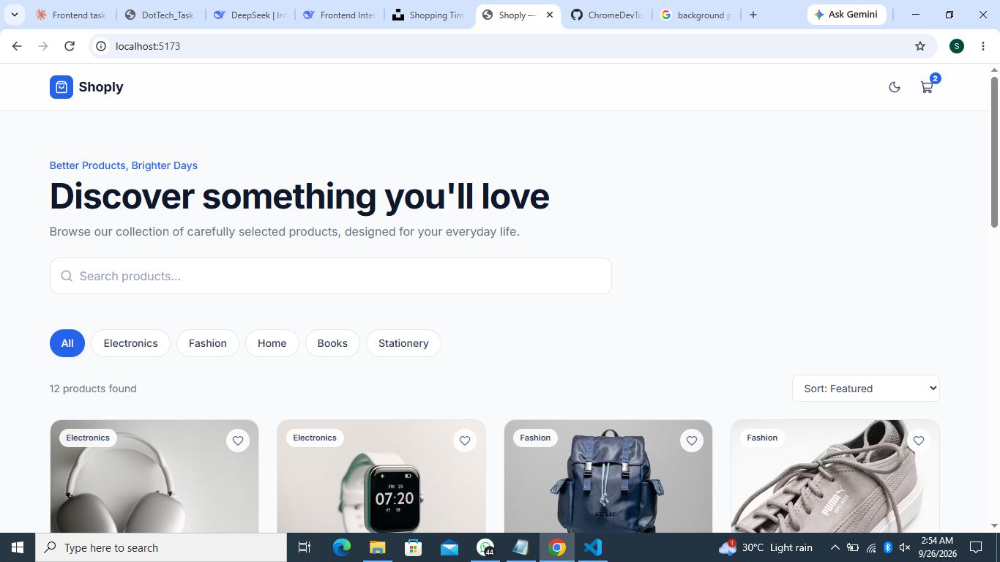
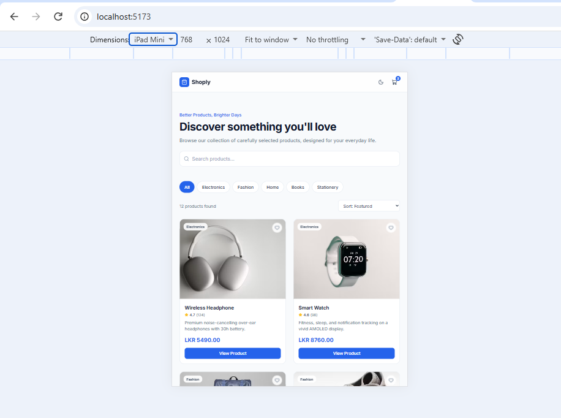
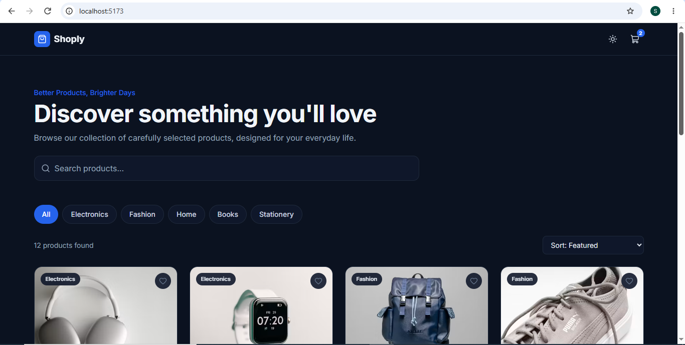
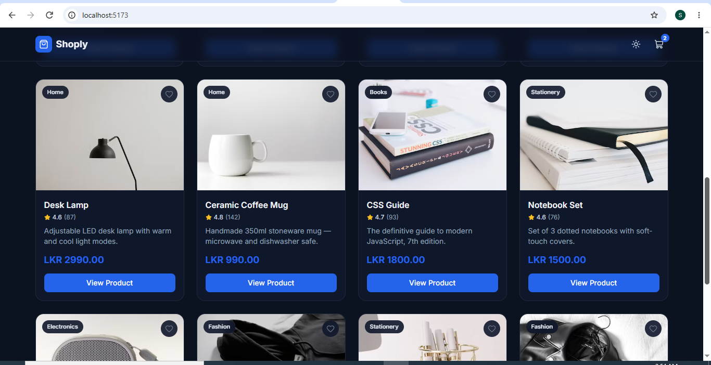
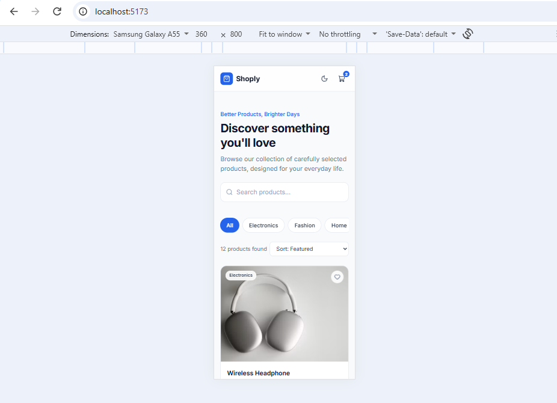
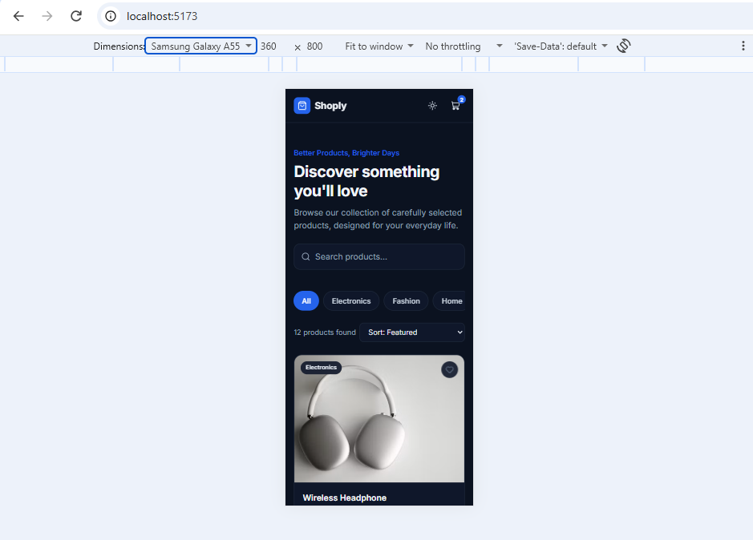
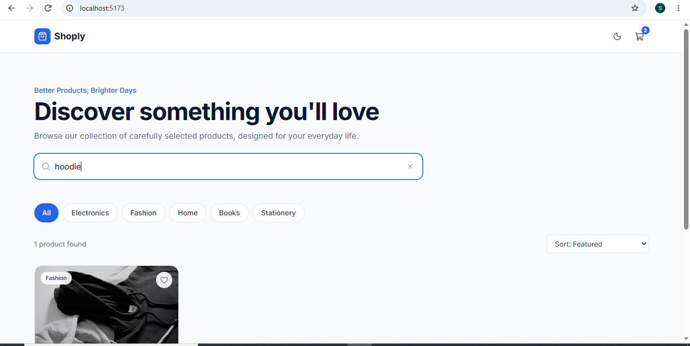
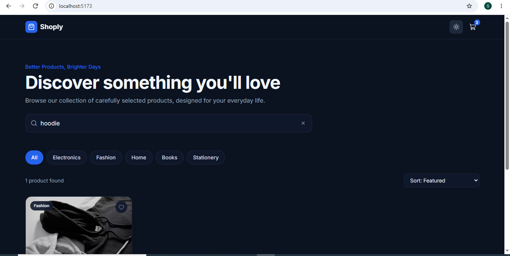
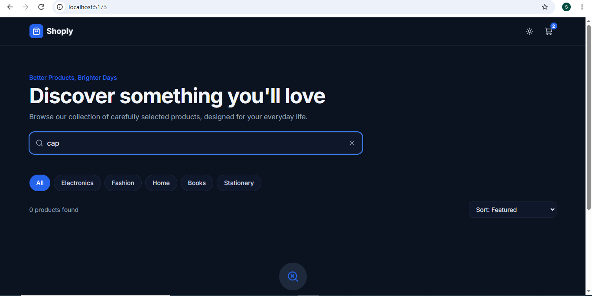

# Shoply - e-commerce-style web application.

A responsive e-commerce product listing page built with React + Vite + Tailwind CSS.



## Features

- **12 hardcoded products** across 5 categories
- **Real-time search** — filters products by name as you type
- **Category filter** — All / Electronics / Fashion / Home / Books / Stationery
- **Sort options** — Featured, Price (↑ / ↓), Name (A→Z)
- **Empty state** — clear message + reset button when no results match
- **Loading skeleton** — animated placeholders on first render
- **Dark mode** — toggle in navbar, persisted in `localStorage`
- **Fully responsive** — 1 column on mobile → 4 columns on desktop

## Run Locally

```bash
# 1. Clone the repo
git clone https://github.com/<your-username>/shoply.git
cd shoply

# 2. Install dependencies
npm install

# 3. Start the dev server
npm run dev
```

Open [http://localhost:5173](http://localhost:5173) in your browser.

## Tech Stack

| Technology | Purpose |
|---|---|
| React 18 | UI library, component-based structure |
| Vite | Fast dev server + build tool |
| JavaScript (ES6+) | Search, filtering, sorting logic |
| Tailwind CSS 3 | Styling, responsive layout, dark mode |
| Lucide React | Icons (search, cart, sun/moon, heart, star) |
| Google Fonts – Inter | Typography |

## Project Structure

```
src/
├── components/
│   ├── Navbar.jsx           # Top bar: logo, dark mode, cart
│   ├── Hero.jsx             # Headline + search input
│   ├── SearchBar.jsx        # Reusable search input with clear button
│   ├── CategoryFilter.jsx   # Category chips
│   ├── SortDropdown.jsx     # Sort options
│   ├── ProductCard.jsx      # Single product card
│   ├── ProductGrid.jsx      # Grid wrapper (handles loading state)
│   ├── SkeletonCard.jsx     # Loading placeholder
│   └── EmptyState.jsx       # "No products found" state
├── data/
│   └── products.js          # Hardcoded product data (12 items)
├── hooks/
│   └── useTheme.js          # Dark mode logic + localStorage
├── App.jsx                  # Main app — assembles everything
├── main.jsx                 # React entry point
└── index.css                # Tailwind directives + global styles
```

## Key Decisions

- **Emoji/emoji-free images** — used real product photos from Unsplash CDN instead of local files for zero-setup and instant loading. All URLs are stable and free.
- **`useMemo` for filtering** — the filtered list is *derived* from search + category + sort. `useMemo` recalculates only when those inputs change, avoiding unnecessary re-renders.
- **Tailwind over plain CSS** — faster responsive design, consistent spacing, and first-class dark mode via the `dark:` prefix.
- **Category chips over dropdown** — chips are one tap on mobile and visually scannable for 6 categories.
- **Fixed 700ms loading state** — simulates a real API call so the skeleton screen is visible during evaluation.

## Color Palette

| Role | Light | Dark |
|---|---|---|
| Primary | `#2563EB` | `#2563EB` |
| Page background | `#F8FAFC` | `#0B1220` |
| Card surface | `#FFFFFF` | `#0F172A` |
| Main text | `#0F172A` | `#F1F5F9` |
| Secondary text | `#64748B` | `#94A3B8` |
| Border | `#E2E8F0` | `#1E293B` |

## Trade-offs / Future Improvements

With more time, I would add:

- **Product detail page** — currently the "View Product" button is a visual CTA only. Would add React Router and a detail screen with larger image, full description, and reviews.
- **Pagination or infinite scroll** — 12 items fit comfortably, but a catalog of 50+ would need paging.
- **URL query sync** — persist `?q=search&cat=Fashion&sort=price-asc` to the URL so filter state is shareable and browser back works.
- **Debounced search** — currently filters on every keystroke. Debounce (~200ms) would help with larger datasets.
- **Cart functionality** — the cart badge is decorative. Would add a real cart drawer with add/remove.
- **Wishlist** — the heart icon is currently visual only. Would add persistent favorites with `localStorage`.
- **Automated tests** — would add Vitest + React Testing Library for the filter logic and key components.
- **Accessibility audit** — add focus rings, ARIA labels, keyboard navigation for chips/dropdown.

##  Screenshots

### Desktop — Light Mode


### Desktop — Dark Mode1


### Desktop — Dark Mode2


### Mobile — Light Mode


### Mobile — Dark Mode


### Filtered View — Light Mode


### Filtered View — Dark Mode


### Empty State


## License
Built as part of an internship application task.

## Author
Sainab Kaleel